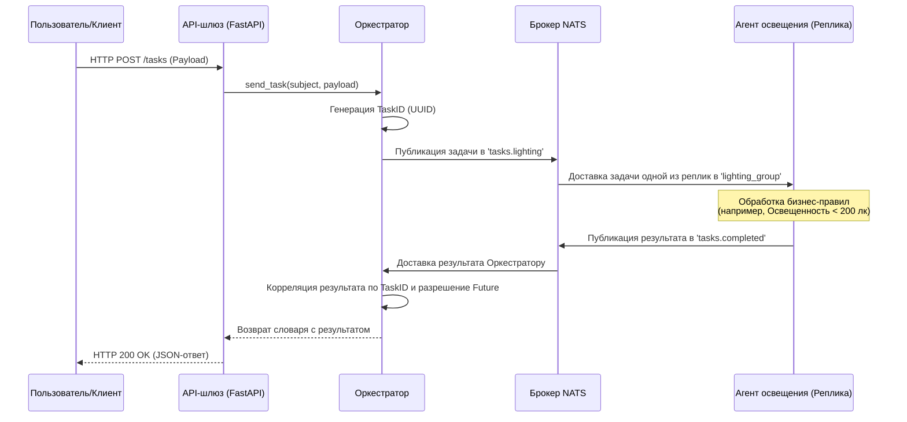

# Архитектурная документация: Мультиагентная система (МАС) «Умный дом»

## 1. Обзор системы
Мультиагентная система «Умный дом» представляет собой распределенную архитектуру, предназначенную для эффективного и отказоустойчивого управления устройствами умного дома. Система базируется на подходе **МАС (Multi-Agent System)**, где специализированные агенты отвечают за конкретные области (например, освещение, климат), а центральный оркестратор координирует их действия.

### Основной поток данных:
`Внешний клиент` $\to$ `API-шлюз (FastAPI)` $\to$ `Оркестратор` $\to$ `Брокер NATS` $\to$ `Специализированные агенты` $\to$ `Возврат результата`

---

## 2. Диаграмма взаимодействия
Следующая диаграмма последовательности иллюстрирует жизненный цикл одного запроса на выполнение задачи.

---

## 3. Описание компонентов

### 🌐 API-шлюз (FastAPI)
Точка входа в систему. Обеспечивает RESTful интерфейс для взаимодействия внешних клиентов с МАС.
- **Обязанности**: 
    - Валидация запросов с помощью Pydantic-моделей.
    - Трансляция HTTP-запросов в команды оркестратора.
    - Маппинг внутренних исключений системы (например, `TimeoutError`) в стандартные HTTP-статусы (504, 503).

### 🧠 Оркестратор (AgentOrchestrator)
Центральный координатор системы.
- **Обязанности**:
    - **Корреляция**: Использование маппинга `TaskID` $\to$ `asyncio.Future` для реализации паттерна «Запрос-Ответ» поверх асинхронного брокера Pub-Sub.
    - **Отказоустойчивость**: Реализация механизма повторных попыток (до 3 раз) при возникновении `ConnectionError` или `TimeoutError`.
    - **Жизненный цикл**: Управление состоянием подключения к брокеру NATS.

### ⚡ Брокер NATS
Высокопроизводительный посредник сообщений.
- **Обязанности**:
    - **Маршрутизация**: Доставка сообщений на основе тем (subjects), таких как `tasks.lighting` и `tasks.completed`.
    - **Балансировка нагрузки**: Реализация паттерна «Конкурирующие потребители» через **Queue Groups** (`lighting_group`), что гарантирует обработку каждой задачи только одним из доступных агентов.

### 💡 Агент освещения (Go)
Специализированный воркер, отвечающий за управление освещением.
- **Обязанности**:
    - **Доменная логика**: Обработка команд изменения состояния и яркости.
    - **Автономность**: Реализация а-приорного бизнес-правила: если уровень освещенности падает ниже 200 лк, агент автоматически принудительно включает свет и устанавливает минимальную яркость 100, независимо от запроса.

---

## 4. Архитектурные паттерны

### Запрос-Ответ поверх Pub-Sub (Request-Response over Pub-Sub)
Поскольку NATS работает по принципу асинхронной рассылки, система реализует синхронный интерфейс для клиентов. Это достигается за счет генерации уникального **Correlation ID (UUID)** для каждой задачи и ожидания соответствующего ID в теме результатов.

### Конкурирующие потребители (Competing Consumers)
Для обеспечения высокой доступности и масштабируемости могут быть развернуты несколько экземпляров одного агента. Использование **NATS Queue Groups** позволяет равномерно распределять задачи между репликами, предотвращая дублирование обработки и балансируя нагрузку.

### Отказоустойчивость (Resilience)
Система спроектирована для работы в условиях кратковременных сбоев. Если агент не отвечает или соединение временно разорвано, Оркестратор автоматически повторяет запрос до 3 раз с небольшой задержкой, что значительно повышает вероятность успешного выполнения операции.

---

## 5. Технологический стек
- **Язык (Агенты)**: Go (Golang)
- **Язык (Оркестратор/API)**: Python 3.11+ (Asyncio, FastAPI)
- **Брокер сообщений**: NATS
- **Контейнеризация**: Docker & Docker Compose
